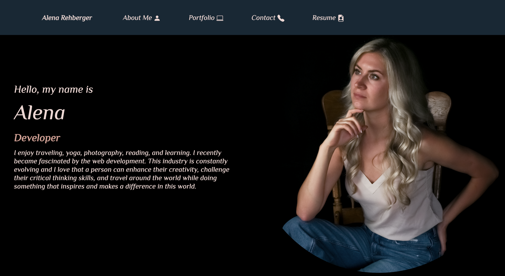

# React-Portfolio

https://github.com/AlenaReh/React-Portfolio

## Description 
A simple REACT portfolio with some of my latest projects.

## Demo 

***

## Table of Contents
* [Technologies used](#technologies-used)
* [Contributions](#Contributions)
* [Credits](#Credits)
* [Contact](#Contact)

## Technologies used

  - JSX
  - CSS
  - Node.js
  - Express.js
  - React

## Contributions
  *Alena Rehberger*

## Credits
  Thanks to Trilogy Education Services for inspiring me to create this portfolio.

## Contact
  If you have any questions, feel free to cantact me at: 
  * GitHub: https://github.com/AlenaReh
  * Linkedin: https://www.linkedin.com/in/alena-rehberger/
  * E-mail: alenarehberger92@gmail.com